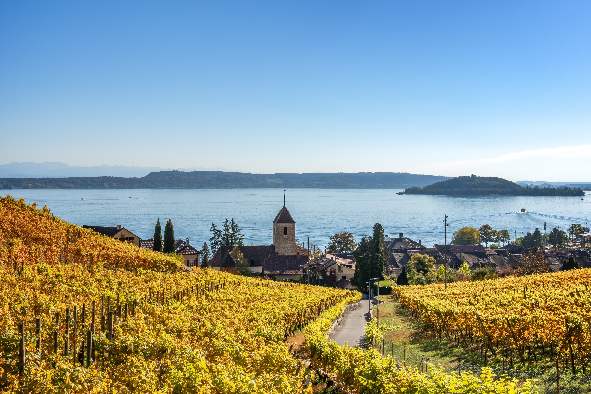

{width="1.2333333333333334in" height="1.448611111111111in"}

{width="8.259722222222223in" height="5.50625in"}

# Zusammenfassung

Verantwortlich: Roman/Fabienne

Standortanalyse für die Anbaueignung verschiedener Rebsorten in den Kantonen Aargau, Bern und Zug

Abbildung Titelseite: Rebbau am Bielersee im Kanton Bern, Schweiz

Quelle: Adobe Stock von Stephanie Jud

Forschungsgruppen Geography of Food, Geoinformatik und Hortikultur

Zürcher Hochschule für Angewandte Wissenschaften ZHAW

Institut für Umwelt und Natürliche Ressourcen

Grüentalstrasse 14

8820 Wädenswil

**Copyright © Datum XX**

Verantwortlich: Alle jeweils für ihre Kapitel
